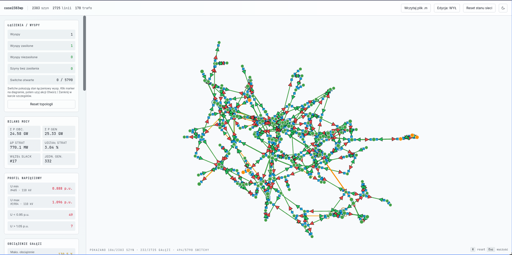

# kse-grid

Interaktywna aplikacja do analizy i wizualizacji sieci elektroenergetycznych na podstawie plików **MATPOWER** (`.m`). Projekt łączy obliczenia rozpływu mocy w **pandapower** z webowym interfejsem uruchamianym lokalnie przez **FastAPI**, **Vue 3**, **Plotly** i **PixiJS**.

`kse-grid` pozwala:

- wczytać case MATPOWER z linii poleceń albo z poziomu UI,
- uruchomić load flow AC,
- analizować obciążenia linii i transformatorów,
- filtrować sieć po poziomach napięć, mocy i obciążeniu,
- pracować w widoku grafowym, geograficznym i referencyjnym atlasu KSE,
- edytować topologię i wybrane parametry elementów bezpośrednio w interfejsie.



---

## Spis treści

1. [Najważniejsze możliwości](#najważniejsze-możliwości)
2. [Wymagania](#wymagania)
3. [Szybki start](#szybki-start)
4. [Uruchamianie](#uruchamianie)
5. [Użycie jako biblioteka Python](#użycie-jako-biblioteka-python)
6. [Interfejs użytkownika](#interfejs-użytkownika)
7. [Dane geograficzne i pliki pomocnicze](#dane-geograficzne-i-pliki-pomocnicze)
8. [Struktura projektu](#struktura-projektu)
9. [Rozwiązywanie problemów](#rozwiązywanie-problemów)
10. [Licencja](#licencja)
11. [Afiliacja](#afiliacja)

---

## Najważniejsze możliwości

- **Obsługa plików MATPOWER (`.m`)** z automatycznym importem do pandapower.
- **Rozpływ mocy AC** uruchamiany lokalnie podczas startu aplikacji oraz po wgraniu nowego case'a.
- **Widok grafowy** do szybkiej pracy na topologii i ręcznego kształtowania layoutu.
- **Widok OpenStreetMap** dla sieci posiadających współrzędne WGS84.
- **Widok Atlas KSE** jako warstwa referencyjna do porównań z rzeczywistą topologią.
- **Filtrowanie po napięciu, typie elementu, mocy i obciążeniu** z natychmiastową aktualizacją widoku.
- **Wyszukiwanie szyn i karta szczegółów** dla busów, linii, transformatorów i łączników.
- **Tryb edycji** obejmujący przesuwanie węzłów, załamywanie linii oraz edycję parametrów elementów.
- **Upload nowego case'a z poziomu UI** bez restartu procesu serwera.
- **Raport tekstowy w terminalu** przez `KSEGrid.report()`.

---

## Wymagania

- **Python 3.13** lub nowszy
- **git**
- zalecany **[uv](https://docs.astral.sh/uv/)** do instalacji zależności i uruchamiania projektu

Główne zależności runtime:

- `pandapower`
- `fastapi`
- `uvicorn`
- `matpowercaseframes`
- `python-multipart`

---

## Szybki start

### Linux / macOS

```bash
git clone https://github.com/dominikKowalczyk17/kse_grid.git
cd kse_grid
uv sync
uv run python main.py
```

### Windows (PowerShell)

```powershell
git clone https://github.com/dominikKowalczyk17/kse_grid.git
cd kse_grid
uv sync
uv run python main.py
```

Po uruchomieniu aplikacja:

1. wczyta domyślny case `data/case2383wp.m`,
2. policzy rozpływ mocy,
3. uruchomi lokalny serwer pod adresem `http://127.0.0.1:8050/`,
4. otworzy interfejs w przeglądarce.

Aby zatrzymać serwer, użyj `Ctrl+C`.

### Instalacja bez `uv`

```bash
python3.13 -m venv .venv
source .venv/bin/activate
pip install -e .
python main.py
```

Na Windows:

```powershell
py -3.13 -m venv .venv
.\.venv\Scripts\Activate.ps1
pip install -e .
python main.py
```

---

## Uruchamianie

### Domyślny case

```bash
uv run python main.py
```

### Własny plik MATPOWER

```bash
uv run python main.py path/to/case.m
```

### Wgrywanie pliku z poziomu UI

W nagłówku aplikacji dostępny jest przycisk **„Wczytaj plik .m”**. Po wybraniu pliku pojawia się backdrop z paskiem postępu, a nowy case zastępuje aktualną sesję bez restartu serwera.

> Wgrany plik jest przechowywany tylko w bieżącej sesji procesu. Odświeżenie strony zachowuje aktualny case, ale restart procesu bez argumentu wraca do domyślnego `data/case2383wp.m`.

---

## Użycie jako biblioteka Python

```python
import kse_grid

# uruchom dashboard dla case'a MATPOWER
kse_grid.KSEGrid.from_matpower_case("case.m").run_powerflow().serve()
```

```python
import kse_grid

grid = kse_grid.KSEGrid.from_matpower_case("case.m").run_powerflow()
grid.report()   # raport tekstowy w terminalu
grid.serve()    # dashboard w przeglądarce
```

### Dostęp do obiektu pandapower

```python
import kse_grid

grid = kse_grid.KSEGrid.from_matpower_case("case.m").run_powerflow()
print(grid.net.res_bus.head())
print(grid.net.res_line[grid.net.res_line.loading_percent > 100])
```

### Parametry obliczeń

```python
grid.run_powerflow(
    algorithm="nr",
    max_iteration=100,
    tolerance_mva=1.5,
)
```

---

## Interfejs użytkownika

### Tryby widoku

- **Graf** — domyślny widok topologiczny do pracy na strukturze sieci.
- **OpenStreetMap** — widok geograficzny dla case'ów z dostępnymi współrzędnymi WGS84.
- **Atlas KSE** — widok referencyjny oparty o wbudowane warstwy atlasu KSE 2019.

### Panel boczny

Panel po lewej stronie udostępnia:

- podstawowe statystyki sieci,
- diagnostykę napięć i obciążeń,
- histogram napięć,
- wyszukiwarkę szyn,
- filtry napięć,
- filtry typów elementów,
- filtry mocy i obciążenia,
- przełączanie trybu widoku,
- reset widoku i reset topologii.

Panel można zwinąć małym uchwytem ze strzałką przy jego prawej krawędzi; ponowne kliknięcie rozwija go z animacją, a wybór jest zapamiętywany w przeglądarce.

### Karta szczegółów i edycja

Po kliknięciu elementu pojawia się karta szczegółów. W zależności od typu elementu można:

- podejrzeć podstawowe parametry i wyniki rozpływu,
- przełączać stan łączników,
- edytować parametry elementu,
- w trybie edycji modyfikować layout grafu.

### Skróty i interakcje

- **klik** — zaznaczenie elementu,
- **klik w tło** — usunięcie zaznaczenia,
- **scroll** — zoom,
- **drag** — pan,
- **R** — reset widoku,
- **Esc** — wyczyszczenie zaznaczenia.

### Kolorystyka diagnostyczna

- **linie / transformatory**: kolor odzwierciedla poziom obciążenia,
- **szyny**: kolor odzwierciedla poziom napięcia w p.u.,
- **strzałki na gałęziach**: pokazują kierunek przepływu mocy czynnej i biernej.

---

## Dane geograficzne i pliki pomocnicze

Nie każdy plik MATPOWER zawiera geometrię. Dla części datasetów — zwłaszcza z paczek TAMU — współrzędne trzeba przygotować osobno.

### Sidecar GeoJSON

Aplikacja obsługuje pomocnicze pliki:

- `data/<stem>.geojson`
- `data/<stem>.json`
- `data/<stem>_wgs84.geojson`
- `data/<stem>_geo.geojson`

Plik powinien zawierać `FeatureCollection` z punktami `Point` opisującymi położenie szyn.

### Konwersja danych TAMU z `.EPC`

```bash
uv run python -m kse_grid.convert_tamu_geo "/path/case.EPC" --out data/case.geojson
```

### Dopasowanie do atlasu KSE z pliku KMZ

```bash
uv run python -m kse_grid.convert_kse_kmz \
  --epc "/path/case.EPC" \
  --kmz "/path/KSE_2019.kmz" \
  --out data/case.geojson
```

### Odświeżenie warstw atlasu KSE

```bash
uv run python -m kse_grid.convert_kse_atlas docs/03-materialy-zrodlowe/kse-atlas/KSE_2019.kmz
```

---

## Struktura projektu

```text
.
├── data/                     # przykładowe case'y i pliki pomocnicze
├── docs/                     # materiały źródłowe i grafiki
├── kse_grid/
│   ├── grid.py               # główna klasa KSEGrid
│   ├── matpower.py           # import MATPOWER i sidecarów GeoJSON
│   ├── runner.py             # obliczenia load flow
│   ├── serializer.py         # serializacja sieci do JSON dla frontendu
│   ├── switching.py          # sesja przełączeń i edycji
│   ├── web_server.py         # FastAPI + REST API + static frontend
│   └── web/                  # frontend Vue / Plotly / PixiJS
├── main.py                   # punkt startowy aplikacji
├── pyproject.toml            # konfiguracja projektu Python
└── README.md
```

---

## Rozwiązywanie problemów

| Problem | Rozwiązanie |
| --- | --- |
| `ModuleNotFoundError: matpowercaseframes` | Zainstaluj zależności przez `uv sync` albo `pip install -e .`. |
| Port `8050` jest zajęty | Uruchom aplikację na innym porcie lub zwolnij zajęty port. |
| Widok **OpenStreetMap** jest zablokowany | Case nie ma danych geograficznych. Przygotuj sidecar GeoJSON albo dane z `.EPC` / `.KMZ`. |
| Po restarcie aplikacji zniknął wgrany przez UI case | To oczekiwane: upload działa tylko w pamięci bieżącej sesji procesu. |
| PowerShell blokuje aktywację venv | Ustaw `Set-ExecutionPolicy -Scope CurrentUser -ExecutionPolicy RemoteSigned`. |
| `pandapower` zgłasza ostrzeżenia dla niektórych publicznych case'ów | Część datasetów MATPOWER wymaga defensywnego importu; projekt zawiera obsługę typowych problemów wejściowych. |

---

## Licencja

Projekt jest udostępniany na licencji **MIT**.

## Afiliacja

Projekt powstał w **Instytucie Elektroenergetyki Politechniki Łódzkiej (i22)**.
