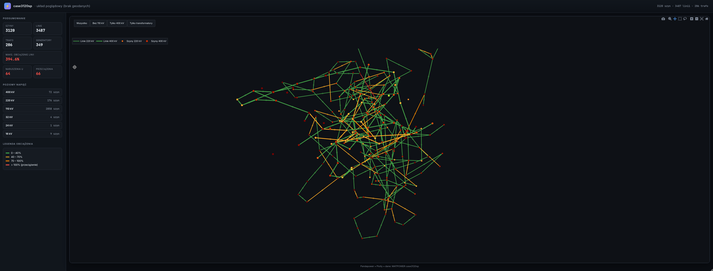

# kse_grid – Interaktywny plotter sieci elektroenergetycznej

Narzędzie do wizualizacji i analizy rozpływu mocy z plików MATPOWER (`.m`), oparte o [pandapower](https://www.pandapower.org/), FastAPI i Plotly (frontend Vue 3 bez bundlera).

- Wczytuje dowolny plik `.m` (format MATPOWER)
- Liczy rozpływ mocy (algorytm Iwamoto-NR, start AC)
- Otwiera interaktywny dashboard w przeglądarce z filtrami napięć, wyszukiwaniem szyn i kartą szczegółów na wykresie



---

## Spis treści

1. [Instalacja](#instalacja)
2. [Uruchomienie](#uruchomienie)
3. [Użycie z poziomu kodu](#użycie-z-poziomu-kodu)
4. [Dashboard](#dashboard)
5. [Struktura projektu](#struktura-projektu)
6. [Rozwiązywanie problemów](#rozwiązywanie-problemów)

---

## Instalacja

Wymagania:

- **Python 3.13** lub nowszy
- **git**
- Zalecany [uv](https://docs.astral.sh/uv/) – szybki menedżer pakietów. Można też użyć `pip` + `venv`.

### Linux / macOS

```bash
# 1. Zainstaluj uv (jednorazowo)
curl -LsSf https://astral.sh/uv/install.sh | sh
exec $SHELL

# 2. Sklonuj repo i zainstaluj zależności
git clone https://github.com/dominikKowalczyk17/kse_grid.git
cd kse_grid
uv sync

# 3. Aktywuj venv (opcjonalnie – uv run działa bez aktywacji)
source .venv/bin/activate
```

Bez `uv`:

```bash
python3.13 -m venv .venv
source .venv/bin/activate
pip install -e .
```

### Windows (PowerShell)

```powershell
# 1. Zainstaluj Python 3.13 ze https://www.python.org/downloads/windows/
#    Zaznacz „Add python.exe to PATH" w instalatorze.

# 2. Zainstaluj uv
powershell -ExecutionPolicy ByPass -c "irm https://astral.sh/uv/install.ps1 | iex"

# 3. Zrestartuj PowerShell, potem:
git clone https://github.com/dominikKowalczyk17/kse_grid.git
cd kse_grid
uv sync
.\.venv\Scripts\Activate.ps1
```

> Jeśli PowerShell odmówi aktywacji skryptu:
> `Set-ExecutionPolicy -Scope CurrentUser -ExecutionPolicy RemoteSigned`

Bez `uv`:

```powershell
py -3.13 -m venv .venv
.\.venv\Scripts\Activate.ps1
pip install -e .
```

### Sprawdzenie instalacji

```bash
python -c "import pandapower, plotly, matpowercaseframes; print('OK')"
```

---

## Uruchomienie

```bash
# domyślny plik (data/case3120sp.m)
python main.py

# własny plik .m
python main.py ścieżka/do/case.m

# bez aktywacji venv (z uv)
uv run python main.py
```

Co się dzieje po uruchomieniu:

1. Wczytanie pliku `.m` (+ ewentualnego sidecara z geometrią)
2. Obliczenia load flow – Newton-Raphson Iwamoto, start AC (U=1 p.u., kąt=0°)
3. Wygenerowanie widoku sieci: spring layout albo OpenStreetMap, jeśli case dostarczy współrzędne WGS84
4. Start serwera FastAPI pod `http://127.0.0.1:8050/` i otwarcie przeglądarki

Serwer działa do `Ctrl+C`.

---

## Użycie z poziomu kodu

### Podstawowe użycie

```python
import kse_grid

kse_grid.KSEGrid.from_matpower_case("data/case3120sp.m").run_powerflow().serve()
```

### Z raportem tekstowym

```python
import kse_grid

grid = kse_grid.KSEGrid.from_matpower_case("case.m").run_powerflow()
grid.report()    # bilans mocy, napięcia, top 10 linii – w terminalu
grid.serve()     # dashboard w przeglądarce
```

### Dostęp do danych pandapower

```python
net = grid.net
print(net.res_bus.head())                                    # wyniki napięć
print(net.res_line[net.res_line.loading_percent > 100])      # przeciążone linie
```

### Parametry obliczeń

```python
grid.run_powerflow(
    algorithm="iwamoto_nr",  # stabilniejszy od klasycznego NR przy słabych sieciach
    max_iteration=100,
    tolerance_mva=1.0,
)
```

---

## Dashboard

Po wejściu na `http://127.0.0.1:8050/`:

- **Lewy panel** – podsumowanie sieci, wyszukiwarka szyn, reset widoku, przełącznik trybu (Graf / OpenStreetMap), filtry napięć i typów elementów oraz legendy.
- **Tryb Graf** – spring layout w dwuwymiarowej przestrzeni abstrakcyjnej.
- **Tryb OpenStreetMap** – sieć nałożona na szarą mapę (`carto-positron`) z zaznaczonym konturem Polski. Aktywny tylko jeśli case ma geometrię WGS84.
- **Tryb Atlas KSE** – osobny widok referencyjny (ciekawostka): 2308 stacji NN/110 kV z OpenInfraMap (KSE 2019) jako szare kropki. Bez modelu pandapower – służy do wzrokowej weryfikacji pokrycia datasetu.
- **Kolor linii i transformatorów** = obciążenie prądowe:
  - 🟢 0–40 % → 🟡 40–70 % → 🟠 70–100 % → 🔴 > 100 % (przeciążenie).
- **Kolor węzłów (szyn)** = napięcie `Um` w binach traffic-light:
  - 🟣 < 0.90 p.u. (krytycznie niskie)
  - 🔵 0.90 – 0.95 (niskie)
  - 🟢 0.95 – 1.05 (OK)
  - 🟠 1.05 – 1.10 (wysokie)
  - 🔴 > 1.10 p.u. (krytycznie wysokie)
- **Domyślny widok** – startowo pokazywany jest **rdzeń 400/220 kV**, żeby duże przypadki były czytelniejsze.
- **Presety filtrów napięć:** `Rdzeń 400/220`, `Wszystkie`, `Żadne`.
- **Checklisty** – niezależne włączanie poziomów napięć i typów elementów (`Linie`, `Transformatory`, `Szyny`).
- **Interakcja:** klik = karta szczegółów, klik w tło = usunięcie zaznaczenia, wyszukiwarka = centrowanie, scroll = zoom, drag = pan.

> Jeśli case zawiera geometrię WGS84 (bezpośrednio albo przez sidecar GeoJSON o tej samej nazwie), aplikacja startuje od razu w trybie OpenStreetMap.

### Tryb mapowy z paczek TAMU

Pliki `.m` od [TAMU Polish Grid](https://electricgrids.engr.tamu.edu/electric-grid-test-cases/polish-grid/) **nie zawierają geo** w samym MATPOWER. Współrzędne stacji 400/220 kV znajdują się w pliku PowerWorld `.EPC` z paczki TAMU. Konwertujemy je do GeoJSON sidecara:

```bash
uv run python -m kse_grid.convert_tamu_geo "/path/case.EPC" --out data/case.geojson
```

#### Lepsza dokładność z atlasem KSE (KMZ)

Współrzędne TAMU z `.EPC` są przybliżone (centra stacji 400/220 kV). Jeśli masz atlas KSE w formacie KMZ (np. `KSE_2019.kmz` z OpenInfraMap / OSM), możesz dopasować nazwy stacji TAMU do polskich nazw z KMZ:

```bash
uv run python -m kse_grid.convert_kse_kmz \
  --epc "/path/case.EPC" \
  --kmz "/path/KSE_2019.kmz" \
  --out data/case.geojson
```

Wynikowy sidecar zawiera w `properties.source` znacznik `"kmz"` (dokładne coords z KMZ) lub `"epc"` (fallback z TAMU EPC). Dopasowanie korzysta z normalizacji nazw (usunięcie diakrytyków, kodów PowerWorld i fuzzy match `difflib`). Stroj `--cutoff` (domyślnie 0.86) reguluje agresywność dopasowania.

Sidecar musi mieć ten sam stem co `.m` (np. `case2746wop_TAMU_Updated.m` ↔ `case2746wop_TAMU_Updated.geojson`). Po konwersji:

```bash
uv run python main.py data/case2746wop_TAMU_Updated.m
```

#### Atlas KSE 2019 jako warstwa referencyjna

#### Atlas KSE 2019 jako osobny widok

Niezależnie od tego, czy case ma geometrię, w sidebarze dostępny jest tryb **Atlas KSE** — pokazuje on 2308 stacji z atlasu KSE 2019 jako szare kropki na mapie Polski, bez modelu pandapower. To ciekawostka referencyjna, pozwala wzrokowo zweryfikować, czy węzły datasetu TAMU pokrywają się z rzeczywistymi lokalizacjami stacji w polskiej sieci NN/110 kV. Plik `kse_grid/web/kse_atlas_points.geojson` jest wbudowany w aplikację i wygenerowany z `KSE_2019.kmz` (OpenInfraMap / OSM).

### Obsługiwane sidecary GeoJSON

- `data/<stem>.geojson`
- `data/<stem>.json`
- `data/<stem>_wgs84.geojson`
- `data/<stem>_geo.geojson`

Format: `FeatureCollection` z punktami `Point` dla szyn. Dopasowanie po `properties.bus`, `bus_id`, `pp_index`, `id` albo po nazwie (`name`, `bus_name`, `station`).

---

## Struktura projektu

```
kse_grid/
├── main.py                        # punkt startowy – ładuje .m i uruchamia serwer
├── data/
│   ├── case3120sp.m               # przykładowy plik MATPOWER (3120 węzłów)
│   └── case2746wop_TAMU_Updated.* # case TAMU + sidecar .geojson
├── docs/
│   └── preview.png
└── kse_grid/
    ├── __init__.py                # publiczne API pakietu
    ├── grid.py                    # KSEGrid – główna klasa
    ├── matpower.py                # wczytywanie .m + sidecar GeoJSON
    ├── runner.py                  # obliczenia load flow + raport tekstowy
    ├── serializer.py              # net → JSON dla frontendu
    ├── web_server.py              # FastAPI + statyczne pliki frontendu
    ├── convert_tamu_geo.py        # konwerter PowerWorld .EPC → GeoJSON sidecar
    └── web/
        ├── index.html
        ├── main.js                # Vue 3 app (sidebar, wykres, interakcje)
        ├── traces.js              # builder śladów Plotly (graph + scattermapbox)
        ├── icons.js
        ├── style.css
        └── poland_border.geojson  # nakładka konturu Polski w trybie OSM
```

---

## Rozwiązywanie problemów

| Problem | Rozwiązanie |
|---|---|
| `ModuleNotFoundError: matpowercaseframes` | Środowisko nie aktywne lub `uv sync` nie wykonany. Aktywuj venv i powtórz. |
| Port 8050 zajęty | Uruchom `serve(port=...)` albo zwolnij port 8050. |
| `pandapower` zgłasza ostrzeżenia o `BR_B` lub „fake transformers" | Normalne dla `case3120sp.m` – artefakt pliku MATPOWER, wynik PF jest poprawny. |
| Naruszenia napięcia i przeciążenia w `case3120sp` | To celowe – publiczny przypadek jest naciskiem stresowym, nie odwzorowaniem rzeczywistego stanu sieci. |
| Layout grafu trwa długo | Spring layout dla 3120 węzłów to ~7 s, jednorazowo per uruchomienie. W trybie OSM nie ma kosztu layoutu, ale potrzebne są współrzędne WGS84. |
| Chip „OpenStreetMap" jest zablokowany | Case nie ma geometrii. Dla case'ów TAMU wygeneruj sidecar z `.EPC`: `uv run python -m kse_grid.convert_tamu_geo path/do/case.EPC --out data/case.geojson`. |
| TAMU `.m` wywala `IndexError` na `gencost` | Loader automatycznie usuwa blok `mpc.gencost` jeśli pandapower nie potrafi go zaimportować (poly cost > 2nd order). To bezpieczny fallback – PF nadal się liczy. |
| TAMU `.m` wywala `No reference bus` | Loader automatycznie reaktywuje pierwszy `ext_grid` lub ustawia `slack=True` na pierwszym aktywnym generatorze. |
| Windows: PowerShell odmawia aktywacji venv | `Set-ExecutionPolicy -Scope CurrentUser -ExecutionPolicy RemoteSigned`, potem ponownie aktywuj. |
| Brak `python3.13` w systemie | Linux: `uv python install 3.13`. Windows: pobierz z [python.org](https://www.python.org/downloads/). |

---
