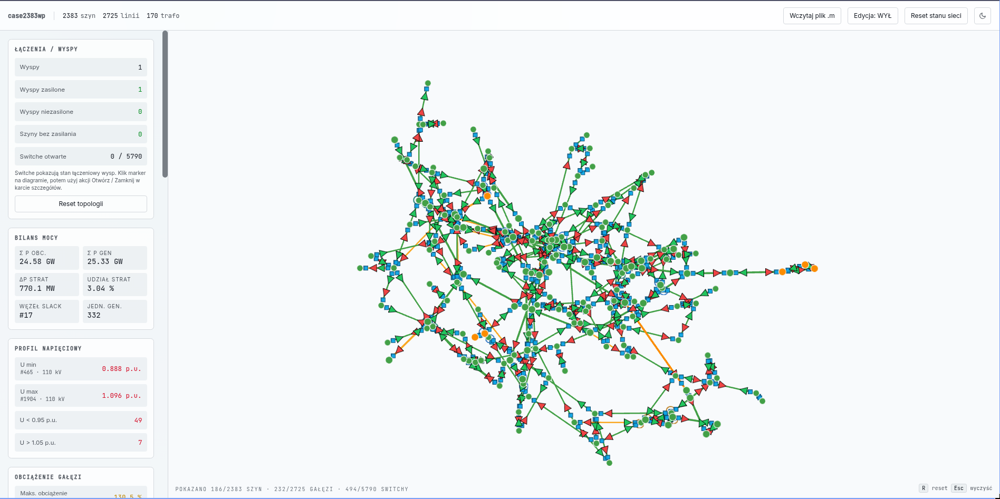

# kse-grid

[](https://github.com/dominikKowalczyk17/kse_grid/actions/workflows/ci.yml)

Interactive power network analysis and visualization tool for **MATPOWER** (`.m`) cases. Combines AC power flow computation via **pandapower** with a locally-served web dashboard built on **FastAPI**, **Vue 3**, **PixiJS**, and **Plotly**.



---

## Feature Highlights

- Load MATPOWER cases from the command line or directly from the browser UI.
- Run AC load flow with pandapower and inspect results immediately.
- Three view modes: **graph topology**, **OpenStreetMap** (WGS84 coordinates), and **KSE Atlas** reference layer.
- Filter network elements by voltage level, element type, active/reactive power, and loading percentage.
- Bus search, per-element detail cards, and inline parameter editing.
- Branch loading and bus voltage colour-coding with active power flow arrows.
- Upload a new case from the UI without restarting the server process.
- Terminal summary report via `KSEGrid.report()`.
- GeoJSON sidecar support for cases that ship without embedded coordinates.

---

## Quick Start

### Linux / macOS

```bash
git clone https://github.com/dominikKowalczyk17/kse_grid.git
cd kse_grid
uv sync
uv run python main.py
```

### Windows (PowerShell)

```powershell
git clone https://github.com/dominikKowalczyk17/kse_grid.git
cd kse_grid
uv sync
uv run python main.py
```

On startup the application:

1. creates an empty editable network,
2. starts a local server at `http://127.0.0.1:8050/`,
3. opens the dashboard in the default browser.

Pass a MATPOWER file path as an argument to load a case at startup and run
the initial AC power flow automatically.

Press `Ctrl+C` to stop the server.

### Without `uv`

```bash
python3.13 -m venv .venv
source .venv/bin/activate   # Windows: .\.venv\Scripts\Activate.ps1
pip install -e .
python main.py
```

---

## Executable Builds

The repository includes a PyInstaller build configuration for single-file
executables on Linux and Windows. The GitHub Actions workflow can build:

- `PowerFlow-linux`
- `PowerFlow.exe`

The build workflow runs manually or when a tag matching `v*` is pushed. For
version tags, the workflow publishes both binaries to the GitHub Release.

---

## Python API

### `KSEGrid`

The primary facade for loading, computing, and serving a network.

```python
import kse_grid

# Load a MATPOWER case and run power flow
grid = kse_grid.KSEGrid.from_matpower_case("case.m")
grid.run_powerflow()
grid.report()   # terminal summary
grid.serve()    # launches browser dashboard

# Fluent chaining
kse_grid.KSEGrid.from_matpower_case("case.m").run_powerflow().serve()

# Access the underlying pandapower network
net = grid.net   # pp.pandapowerNet
print(net.res_bus.head())
print(net.res_line[net.res_line.loading_percent > 100])
```

| Method | Signature | Description |
| --- | --- | --- |
| `from_matpower_case` | `(path: str) -> KSEGrid` | Load a MATPOWER `.m` file and convert it to a pandapower network. |
| `new_empty` | `() -> KSEGrid` | Create an empty network (no case file required). |
| `run_powerflow` | `(algorithm="nr", max_iteration=100, tolerance_mva=1e-3) -> KSEGrid` | Run an AC power flow. Returns `self` for chaining. |
| `report` | `() -> KSEGrid` | Print a text summary of power flow results to stdout. |
| `serve` | `(host="127.0.0.1", port=8050) -> None` | Start the FastAPI server and open the dashboard in the browser. |

### `PowerFlowRunner`

Low-level runner for direct control over calculation and result inspection.

```python
from kse_grid import PowerFlowRunner
import pandapower as pp

net = pp.from_json("network.json")

runner = PowerFlowRunner(net)
runner.run()
runner.summary()
violations = runner.voltage_violations()  # pd.DataFrame
```

| Method | Signature | Description |
| --- | --- | --- |
| `run` | `(algorithm="nr", ...) -> bool` | Execute the AC power flow on the wrapped network and return whether it converged. |
| `summary` | `() -> None` | Print per-bus and per-branch results to stdout. |
| `voltage_violations` | `() -> pd.DataFrame` | Return a DataFrame of buses outside the configured voltage band. |

### `load_matpower_case`

Standalone function that converts a MATPOWER file to a `pandapowerNet` without constructing a `KSEGrid` object.

```python
from kse_grid import load_matpower_case

net = load_matpower_case("case.m")   # returns pp.pandapowerNet
```

---

## CLI Usage

```bash
# Start with an empty editable network
uv run python main.py

# Load a specific MATPOWER case
uv run python main.py path/to/case.m
```

A file can also be loaded at runtime using the **"Load .m file"** button in the dashboard header. The uploaded case replaces the current session without restarting the server process. The upload is in-memory only: restarting the process without a path argument starts a new empty network.

---

## Tech Stack

| Layer | Technology |
| --- | --- |
| **Backend** | Python 3.13+, FastAPI 0.115+, pandapower 3.4+, matpowercaseframes 2.1+ |
| **Frontend** | Vue 3 (ESM CDN, no build step), PixiJS, Plotly 2.35 |
| **Data formats** | MATPOWER `.m`, pandapower JSON, GeoJSON sidecars |
| **Server** | `http://127.0.0.1:8050/` |

---

## Data Format Support

### MATPOWER `.m`

The native input format. Pass the file path on the command line or upload it from the UI. Conversion to pandapower is handled automatically, including defensive handling of missing `gencost` blocks and other common issues found in public MATPOWER datasets.

### pandapower JSON

Any `pandapowerNet` serialised with `pp.to_json()` can be loaded directly via `PowerFlowRunner` or the pandapower API before being passed to `KSEGrid`.

### GeoJSON Sidecars

MATPOWER cases do not always include geographic coordinates. The application looks for a sidecar file alongside the `.m` file using the following naming convention (highest priority first):

- `data/<stem>.geojson`
- `data/<stem>.json`
- `data/<stem>_wgs84.geojson`
- `data/<stem>_geo.geojson`

The sidecar must be a GeoJSON `FeatureCollection` of `Point` features representing bus positions in WGS84.

**Convert TAMU `.EPC` to GeoJSON:**

```bash
uv run python -m kse_grid.converters.tamu_geo "/path/case.EPC" --out data/case.geojson
```

**Match a network to the KSE Atlas from a KMZ file:**

```bash
uv run python -m kse_grid.converters.kse_kmz \
  --epc "/path/case.EPC" \
  --kmz "/path/KSE_2019.kmz" \
  --out data/case.geojson
```

**Refresh KSE Atlas reference layers:**

```bash
uv run python -m kse_grid.converters.kse_atlas docs/03-materialy-zrodlowe/kse-atlas/KSE_2019.kmz
```

---

## Project Structure

```text
.
├── data/                          # sample cases and auxiliary files
├── docs/                          # source materials and graphics
├── kse_grid/
│   ├── grid.py                    # KSEGrid facade
│   ├── web_server.py              # FastAPI server + REST API + static frontend
│   ├── type_coercion.py           # shared type-conversion helpers
│   ├── thresholds.py              # diagnostic thresholds (voltage, loading)
│   │
│   ├── loading/                   # network loading from files
│   │   ├── matpower.py            # orchestrator: case.m -> pandapowerNet
│   │   ├── matpower_importer.py   # .m import with gencost error handling
│   │   ├── network_normalizer.py  # bus name normalisation, slack bus
│   │   └── geojson_loader.py      # GeoJSON sidecar loader
│   │
│   ├── powerflow/                 # power flow computation
│   │   ├── engine.py              # run_powerflow() without presentation
│   │   ├── report.py              # terminal text report
│   │   └── runner.py              # PowerFlowRunner facade
│   │
│   ├── topology/                  # topology operations
│   │   ├── switching.py           # SwitchingSession
│   │   └── element_editing.py     # element parameter editing
│   │
│   ├── serialization/             # JSON serialisation for the frontend
│   │   ├── serializer.py          # serialize_network orchestrator
│   │   ├── graph_layout.py        # spring-layout computation
│   │   ├── geo_positions.py       # WGS84 positions for map view
│   │   ├── element_serializers.py # buses, lines, transformers, switches, gens
│   │   ├── network_stats.py       # network statistics and power totals
│   │   ├── diagnostics.py         # voltage violations and overloads
│   │   └── topology_analysis.py   # islands and de-energised buses
│   │
│   ├── converters/                # external format converters
│   │   ├── tamu_geo.py            # TAMU .EPC -> GeoJSON sidecar
│   │   ├── kse_kmz.py             # network-to-KSE-Atlas matching
│   │   └── kse_atlas.py           # KMZ atlas -> reference layers
│   │
│   └── web/                       # Vue 3 / Plotly / PixiJS frontend
│       ├── main.js, icons.js
│       ├── components/            # app-root, sidebar, graph-panel, ...
│       ├── lib/
│       │   ├── api.js, errors.js, formatters.js, thresholds.js, ...
│       │   └── composables/       # use-network-state, use-topology-ops, ...
│       ├── renderers/pixi/        # PixiJS rendering layer
│       ├── traces/                # Plotly layer configurations
│       └── styles/                # CSS split by component
├── main.py                        # application entry point
├── pyproject.toml                 # Python project configuration
└── README.md
```

---

## Troubleshooting

| Problem | Solution |
| --- | --- |
| `ModuleNotFoundError: matpowercaseframes` | Run `uv sync` or `pip install -e .` to install all dependencies. |
| Port `8050` is already in use | Free the port or modify the default port in `main.py`. |
| **OpenStreetMap** view is unavailable | The case has no geographic data. Prepare a GeoJSON sidecar from `.EPC` or `.KMZ` source files. |
| Uploaded case disappears after server restart | Expected behaviour: UI uploads are in-memory only for the current process session. |
| PowerShell blocks venv activation | Run `Set-ExecutionPolicy -Scope CurrentUser -ExecutionPolicy RemoteSigned`. |
| pandapower convergence warnings on public cases | Some MATPOWER datasets require defensive import handling; the project includes mitigations for the most common input issues. |

---

## License

Released under the **MIT License**.

## Affiliation

Developed at the **Institute of Electrical Power Engineering, Lodz University of Technology (i22)**.
