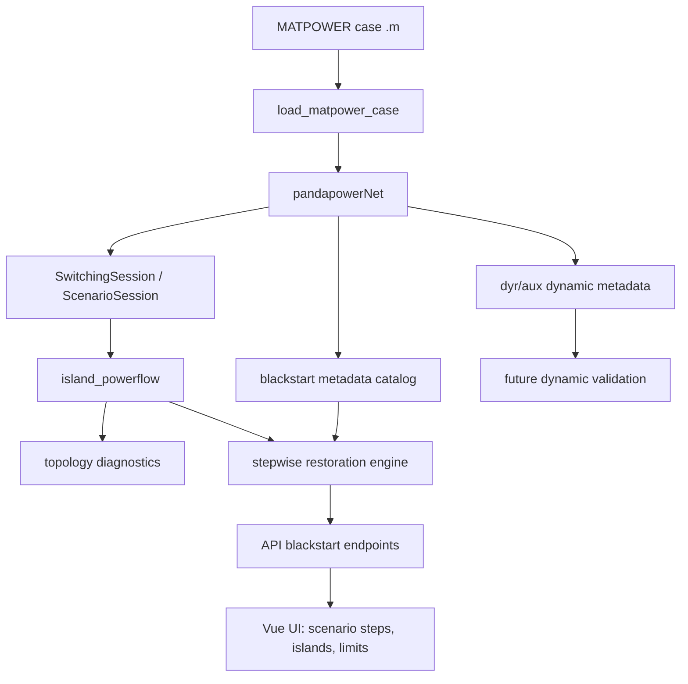

# Energetyczny blackout, strategie PSE na blackstart i symulacja blackstartu w pandapower

## Executive Summary

Publicznie dostepny obraz jest spojny: strategia blackstart / odbudowy KSE jest osadzona w **NC ER (UE 2017/2196)**, wdrozona krajowo przez dokumenty PSE i URE, a sama PSE traktuje blackout jako ryzyko systemowe o bardzo wysokim koszcie ekonomicznym oraz wskazuje na potrzebe **grid-forming**, **kompensatorow synchronicznych**, lepszej obserwowalnosci i zmian prawnych ("pakiet antyblackoutowy").[^1][^2][^3] Jednoczesnie pelny **Plan Obrony i Odbudowy KSE** i komplet warunkow uslugi Black Start nie sa latwo dostepne publicznie w postaci tekstowej; czesc najwazniejszych dokumentow PSE jest publikowana jako binarne PDF/ZIP-y lub przez portal dokumentow trudny do odczytu automatycznego.[^2]

Od strony technicznej **pandapower** nadaje sie do wiarygodnej **quasi-statycznej** symulacji blackstartu: krokowego zamykania lacznikow, zasilania wysp, pickupu generatorow i odbiorow, kontroli napiec, obciazen i zwarc oraz planowania sciezek energizacji na grafie sieci.[^10][^11][^12][^13][^14] Nie jest natomiast natywnym narzedziem do pelnej dynamiki czestotliwosciowej i przejsciowej, wiec koncowa walidacje bardziej wymagajacych scenariuszy nalezaloby oprzec o narzedzie dynamiczne lub co-symulacje.[^10][^12][^14]

Lokalne repozytorium `kse_grid` jest dobra baza do rozwoju takiego symulatora: ma duze polskie case'y MATPOWER, warstwe topologiczna ze switchami na koncach linii/trafo, sesje zmian na kopii roboczej sieci, diagnostyke wysp i gotowy frontend/API.[^17] Najbardziej naturalny kierunek rozwoju to **MVP steady-state restoration** w pandapower, a dopiero potem parser danych dynamicznych `.dyr` / `.aux` i osobna walidacja dynamiczna.[^15][^16][^17]

## Key Sources / Repositories

| Zasob | Rola | Dlaczego wazny |
|---|---|---|
| `strategia.pse.pl` | Publiczna strategia PSE do 2040 | Najlepsze zrodlo jawnych tez PSE o blackout, grid-forming, kompensatorach synchronicznych i "pakiecie antyblackoutowym".[^3] |
| `pse.pl/kodeksy/er` | Wdrozenie NC ER przez PSE | Potwierdza istnienie warunkow dla dostawcow uslug odbudowy, planu testow, planu odbudowy i wykazu SGU.[^2] |
| Rozporzadzenie (UE) 2017/2196 (NC ER) | Podstawa prawna blackstart / restoration | Definiuje bottom-up/top-down re-energisation, frequency leader, restoration plan, obowiazki dostawcow uslug odbudowy.[^1] |
| `e2nIEE/pandapower` + dokumentacja | Silnik symulacji | Zapewnia topologie, PF, zwarcia, kontrolery i petle timeseries potrzebne do modelu quasi-statycznego.[^10][^11][^12][^13][^14] |
| `lanl-ansi/PowerModelsRestoration.jl` | Referencyjna architektura algorytmow odbudowy | Najsilniejszy publiczny punkt odniesienia dla MILP / ordering / load pickup / restoration refinement.[^15] |
| `dominikKowalczyk17/kse_grid` | Lokalna baza wdrozeniowa | Zawiera KSE MATPOWER, API, switching session, detekcje wysp i plan island-aware PF.[^17] |

## 1. Kontekst regulacyjny i operacyjny

NC ER wymaga, aby kazdy TSO utrzymywal **restoration plan** oraz przewidzial zarowno **top-down re-energisation strategy** (odbudowe z pomoca innych TSO), jak i **bottom-up re-energisation strategy** (odbudowe bez pomocy zewnetrznej, czyli klasyczny blackstart).[^1] Szczegolnie wazny jest art. 23 ust. 4 lit. f, ktory wymaga okreslenia liczby zrodel potrzebnych do bottom-up restoration i wskazuje na trzy kluczowe cechy: **black start capability**, **quick re-synchronisation capability** oraz **island operation capability**.[^1]

PSE potwierdza na stronie wdrozeniowej NC ER, ze wdrozyla dokumenty dotyczace dostawcow uslug odbudowy, planu testow, planu obrony systemu, planu odbudowy oraz wykazu SGU; czesc z tych dokumentow zostala zatwierdzona decyzjami URE, ale ich pelna zawartosc nie jest latwo dostepna w tekstowej formie publicznej.[^2] To oznacza, ze **rama prawna** jest jasna, natomiast **szczegoly wykonawcze** (np. dokladne jednostki kontraktowane do BS, szczegolowe progi techniczne i harmonogramy testow) pozostaja czesciowo poza prostym dostepem publicznym.[^2]

Z punktu widzenia operacyjnego PSE podkresla, ze KSE pracuje w oparciu o kryterium **N-1**, a w warunkach eskalacji bezpieczenstwa korzysta z calej drabiny srodkow: od mechanizmow rynkowych i ESP, przez DSR i pomoc miedzyoperatorska, az po stopnie zasilania i wylaczenia rotacyjne.[^4][^5] To wazne, bo blackstart nie jest izolowana procedura, lecz koncem dluzszego lancucha obrony systemu.[^4][^5]

## 2. Co publicznie mowi PSE o blackout i blackstart

Najmocniejsze publiczne sygnaly strategiczne PSE pochodza z serwisu `strategia.pse.pl`. PSE wskazuje tam, ze pelny blackout Polski oznacza koszt rzedu **ok. 40 mld PLN dziennie**, a doswiadczenie blackout'u na Polwyspie Iberyjskim z 2025 r. jest argumentem za budowa nowych narzedzi operacyjnych i zmianami regulacyjnymi.[^3]

PSE jednoznacznie eksponuje potrzebe:
1. **grid-forming** po stronie nowych zrodel/inwerterow,
2. **kompensatorow synchronicznych** jako zrodla inercji i mocy zwarciowej,
3. zwiekszenia **obserwowalnosci i sterowalnosci** zasobow,
4. wsparcia zmian legislacyjnych w ramach "**pakietu antyblackoutowego**".[^3]

To wskazuje, ze wspolczesna strategia PSE nie sprowadza blackstartu wylacznie do kilku klasycznych elektrowni zdolnych do rozruchu autonomicznego. Coraz wazniejsze staja sie tez zasoby zapewniajace **kontrole napieciowa**, **moc zwarciowa**, **zdolnosc pracy wyspowej** i mozliwosc stabilizacji systemu po odbudowie.[^1][^3]

## 3. Lekcje z blackoutow europejskich istotne dla Polski

Zestawienie kilku dobrze opisanych awarii pokazuje wspolne wzorce. Blackout we Wloszech w 2003 r. ujawnil ryzyko **duzej zaleznosci importowej** i katastrofalne skutki opoznionej komunikacji miedzy TSO; po utracie importu samo UFLS nie wystarczylo, by utrzymac system.[^6] Zdarzenie europejskie z 2006 r. jest dla Polski szczegolnie istotne, bo PSE znalazla sie wtedy w wyspie z **nadmiarem generacji** i doswiadczyla problemu overfrequency / island resynchronisation w praktyce.[^7] Blackout turecki 2015 potwierdzil, ze zarowno wyspa deficytowa, jak i nadmiarowa moga sie zawalic, a hydro jest najsilniejszym zasobem blackstartowym w pierwszej fazie odbudowy.[^8]

Najbardziej aktualny wzorzec strategiczny daje blackout iberyjski 2025: wedlug pozniejszych raportow kluczowym problemem nie byla sama "mala inercja", lecz **luki w kontroli napiecia i mocy biernej**, slaba stabilizacja po szybkich zmianach mocy czynnej oraz zbyt mala zdolnosc systemu do podtrzymania synchronizmu.[^3][^9] To dobrze koresponduje z kierunkiem obranym przez PSE: grid-forming, kompensatory synchroniczne i wzmocnienie uslug systemowych.[^3]

### Tabela lekcji

| Zdarzenie | Glowna lekcja | Implikacja dla PSE/KSE |
|---|---|---|
| Wlochy 2003 | Import dependence + slaba komunikacja miedzy TSO moga zamienic awarie w blackout krajowy.[^6] | Polska musi traktowac zdolnosc do bottom-up restoration jako realny wymog, a nie teorie "na wypadek ostateczny". |
| Europa 2006 | Mozliwa jest takze awaria wyspy **z nadmiarem** generacji i problem resynchronizacji.[^7] | Trzeba modelowac nie tylko underfrequency, ale tez overfrequency i laczenie wysp. |
| Turcja 2015 | Hydro jest najpewniejsza kotwica odbudowy, ale utrzymanie N-1 podczas remontow jest krytyczne.[^8] | Warto traktowac ESP/hydro jako glowne nasiona blackstart, a scenariusze outage season symulowac osobno. |
| Iberia 2025 | O sukcesie odbudowy decyduja reactive/voltage support i controllability, nie tylko sama inercja.[^3][^9] | Model blackstartu dla Polski powinien zawierac ograniczenia napieciowe, mocy biernej, Ferrantiego i sciezek energizacji. |

## 4. Na ile pandapower nadaje sie do symulacji blackstartu

Pandapower bardzo dobrze nadaje sie do **sekwencyjnego, quasi-statycznego** modelu blackstartu. Z dokumentacji i przykladow wynika, ze zapewnia:
- budowe grafu sieci z uwzglednieniem lacznikow (`create_nxgraph(..., respect_switches=True)`),
- identyfikacje wysp (`connected_components`, `connected_component`),
- wykrywanie szyn bez zasilenia (`unsupplied_buses`),
- model przelacznikow / odlacznikow / breakerow (`net.switch`, `create_switch`),
- zrodla referencyjne (`ext_grid`) i generatory ze slack / distributed slack,
- kontrolery (`pandapower.control`) i petle krokowa (`run_control`, `run_timeseries`),
- analize zwarciowa (`calc_sc`) i klasyczny load flow.[^10][^11][^12][^13][^14]

To wystarcza do modelowania takich decyzji jak:
1. ktore laczniki zamknac w danym kroku,
2. ktore wyspy sa juz zasilone,
3. czy napiecia i obciazenia po danym kroku pozostaja akceptowalne,
4. czy mozna dolaczyc nastepny generator / transformator / blok obciazen,
5. jaka sciezka energizacji od blackstart source do kolejnego wezla jest najkrotsza / najbezpieczniejsza.[^10][^11][^13]

**Nie wystarcza** natomiast do pelnego odwzorowania:
- przejsciowej dynamiki czestotliwosci i katow w czasie ciaglym,
- pracy regulatorow turbin/governorow i AVR jako ukladow ODE,
- zjawisk synchronizacji wysp w sensie dynamicznym,
- dokladnych pradow udarowych / inrush / transient recovery voltage.[^10][^12][^14]

W praktyce najlepsza strategia to wiec:
- uzyc pandapower do **planowania i walidacji sekwencji steady-state**,
- a trudniejsze scenariusze zweryfikowac narzedziem dynamicznym (np. Dynawo / PSS/E / PowerFactory) albo wlasna co-symulacja na dalszym etapie.[^10][^14][^15]

## 5. Co mowi literatura i open source o budowie takiego symulatora

W publicznych materialach nie znaleziono oficjalnego tutoriala pandapower dokladnie pod blackstart. Najblizszym przykladem uzycia pandapower do restauracji jest praca **Papasani (2021)**, ktora explicite wykorzystuje pandapower do sekwencyjnej energizacji systemu przemyslowego.[^16] Z drugiej strony najbardziej dojrzalym publicznym frameworkiem jest **PowerModelsRestoration.jl**, ktory oferuje formalizacje ROP / MLD / MRSP / RRR i stanowi bardzo dobra inspiracje dla architektury algorytmu po stronie Python/pandapower.[^15]

Z literatury wynikaja trzy klasy podejsc, ktore dobrze przenosza sie na projekt dla Polski:
1. **Graph search / path energization** - na bazie grafu sieci i spanning tree / shortest path.[^10][^15]
2. **MILP / ordering** - do planowania kolejnosci pickupu generatorow i odbiorow oraz ograniczen mocy/ramp.[^15]
3. **Heuristics / recursive refinement** - szybsze algorytmy praktyczne, dobre do MVP i interaktywnego UI.[^15]

## 6. Jak adaptowac lokalne repo `kse_grid`

Lokalne repo juz zawiera kilka kluczowych elementow wymaganych przez symulator blackstartu:
- duze polskie case'y MATPOWER,
- `seed_operational_switches` na koncach linii i traf,
- `SwitchingSession` z izolowana kopia robocza,
- wyliczanie wysp i `unsupplied_buses`,
- API REST oraz frontend z wizualizacja topologii,
- plan implementacyjny island-aware power flow,
- a nawet dane dynamiczne `.dyr` / `.aux`, ktore pozniej mozna zmapowac na modele generatorow.[^17]

### Proponowana architektura

### Warstwy funkcjonalne

1. **blackstart metadata layer** - dopisanie do `net.gen` i `net.load` pol typu `blackstart_capable`, `t_start_min`, `ramp_mw_per_min`, `cranking_power_mw`, `restoration_priority`, `p_crank_mw`.[^17]
2. **island-aware power flow** - uruchamianie PF osobno dla kazdej wyspy, z odroznieniem `converged / unsupplied / not_converged`.[^17]
3. **scenario session** - krokowy silnik `step_forward / step_backward / replay` nad istniejacym `SwitchingSession`.[^17]
4. **planner** - heurystyka lub MILP dla kolejnosci energizacji zrodel, odlacznikow, linii i obciazen, inspirowana ROP / RRR z PowerModelsRestoration.[^15]
5. **dynamic validation layer** - etap pozniejszy, zasilany przez dane `.dyr` / `.aux`, ale najpewniej zewnetrznym solverem dynamicznym.[^10][^14][^17]

### Najwazniejsze brakujace dane

| Dane | Po co | Skad wziac |
|---|---|---|
| `blackstart_capable` | wybor seed units dla bottom-up restoration | IRiESP / warunki PSE / wiedza operatorska |
| `p_min_mw`, `p_max_mw` | minimalna i maksymalna praca jednostki w wyspie | czesciowo juz w MATPOWER `.m`[^17] |
| `ramp_mw_per_min`, `t_start_min` | realizm pickupu generatorow | dane blokow / literatura / operator |
| `cranking_power_mw` | bilans wlasnych potrzeb rozruchowych | dane technologiczne / szacunki inzynierskie |
| `restoration_priority`, `p_crank_mw` dla load | kolejnosc i ciezar pickupu odbiorow | plan odbudowy / zalozenia scenariusza |
| parametry dynamiczne (`H`, regulatory) | pozniejsza walidacja czestotliwosciowa | `.dyr` i `.aux` obecne w repo[^17] |

## 7. Proponowany workflow symulacji blackstartu w pandapower

### MVP steady-state

1. Zaladuj case MATPOWER Polski i wzbogacaj go o katalog metadanych blackstart.
2. Wyzeruj stan sieci do "blackout state": wylacz generatory, otworz odpowiednie laczniki, ustaw stan poczatkowy scenariusza.
3. Wybierz generator / zasob blackstart i przypnij go jako tymczasowy `ext_grid` / slack dla pierwszej wyspy.
4. W kazdym kroku:
   1. zamknij wybrany lacznik lub wlacz generator / blok obciazenia,
   2. wyznacz wyspy,
   3. uruchom PF dla wysp zasilonych,
   4. sprawdz ograniczenia napiecia, obciazen i zwarc,
   5. odrzuc lub zaakceptuj krok.
5. Powtarzaj az do pelnej odbudowy albo dead-end scenariusza.[^10][^11][^13][^14][^15][^17]

### Rozszerzenia pozniejsze

- planner heurystyczny / MILP dla automatycznej propozycji kolejnych krokow,[^15]
- warianty top-down vs. bottom-up zgodnie z NC ER,[^1]
- modelowanie priorytetow odbudowy odbiorow krytycznych,[^1][^2]
- walidacja dynamiczna sciezek odbudowy na podstawie danych `.dyr` / `.aux`.[^17]

## 8. Najwazniejsze wnioski praktyczne

1. **Tak, blackstart dla PSE/KSE da sie sensownie symulowac w pandapower - ale jako model krokowy steady-state, nie pelna dynamike systemu.**[^10][^12][^13][^14]
2. **Najwieksza wartoscia dla PSE nie bylby "jednorazowy runpp", tylko interaktywny lub optymalizowany silnik sekwencji odbudowy wysp.**[^1][^15][^17]
3. **Strategia PSE po blackoutach europejskich jest spojna z tym, co taki model powinien badac: napiecie, moc bierna, controllability, islanding, resynchronisation, domestic restoration seeds.**[^1][^3][^6][^7][^8][^9]
4. **Lokalne repo jest juz blisko potrzebnego punktu startowego.** Najbardziej naturalny nastepny krok to dobudowa `island_powerflow` i `scenario_session`, a nie wymiana technologii.[^17]

## Confidence Assessment

**Wysoka pewnosc:**
- rola NC ER i kluczowych pojec (bottom-up, top-down, restoration plan, frequency leader),[^1]
- publiczne tezy strategiczne PSE o blackout, grid-forming i kompensatorach synchronicznych,[^3]
- mozliwosci i ograniczenia pandapower dla steady-state restoration,[^10][^11][^12][^13][^14]
- przydatnosc lokalnego repo jako bazy do MVP blackstart simulatora.[^17]

**Srednia pewnosc / czesciowo posrednie wnioski:**
- dokladna lista zakontraktowanych przez PSE jednostek Black Start,
- pelne wymagania techniczne z dokumentow PSE/URE publikowanych jako binarne PDF/ZIP,
- szczegolowe parametry rozruchowe konkretnych polskich blokow.

**Kluczowe zalozenie badawcze:**
- publicznie dostepne dokumenty pozwalaja wiarygodnie zaprojektowac **architekture i metodyke** symulatora, ale nie daja jeszcze kompletnego zestawu danych wejsciowych do "produkcyjnego" modelu operatorskiego. Do tego potrzebne bylyby dane PSE/IRiESP albo uzgodnione zalozenia eksperckie.

## Footnotes

[^1]: Commission Regulation (EU) 2017/2196 / NC ER — https://www.legislation.gov.uk/eur/2017/2196
[^2]: PSE NC ER implementation page — https://www.pse.pl/kodeksy/er
[^3]: PSE Strategy 2040 / blackout, grid-forming, synchronous condensers — https://strategia.pse.pl
[^4]: PSE: Jak funkcjonuje Krajowy System Elektroenergetyczny — https://www.pse.pl/jak-funkcjonuje-krajowy-system-elektroenergetyczny
[^5]: PSE: Bilansowanie systemu — https://www.pse.pl/jak-funkcjonuje-krajowy-system-elektroenergetyczny/bilansowanie-systemu
[^6]: UCTE Final Report on the 28 September 2003 Blackout in Italy — https://www.entsoe.eu/fileadmin/user_upload/_library/publications/ce/otherreports/20040427_UCTE_IC_Final_report.pdf
[^7]: UCTE Final Report on the 4 November 2006 system disturbance — https://www.energy.gov/sites/prod/files/oeprod/DocumentsandMedia/UCTE-DisturbanceReport-2006.pdf
[^8]: ENTSO-E Final Report on Blackout in Turkey on 31 March 2015 — https://www.entsoe.eu/Documents/SOC%20documents/Regional_Groups_Continental_Europe/20150921_Black_Out_Report_v10_w.pdf
[^9]: Iberian 2025 blackout synthesis from official ENTSO-E / national reporting, as summarized in public sources cited by the research agent; PSE strategic interpretation is explicit at https://strategia.pse.pl
[^10]: pandapower topology documentation — https://pandapower.readthedocs.io/en/latest/topology.html
[^11]: pandapower switch element documentation — https://pandapower.readthedocs.io/en/latest/elements/switch.html
[^12]: pandapower control loop / controllers — https://pandapower.readthedocs.io/en/latest/control/control_loop.html
[^13]: pandapower time series loop — https://pandapower.readthedocs.io/en/latest/timeseries/timeseries_loop.html
[^14]: pandapower short-circuit calculations — https://pandapower.readthedocs.io/en/latest/shortcircuit/run.html
[^15]: PowerModelsRestoration.jl overview and related paper — https://github.com/lanl-ansi/PowerModelsRestoration.jl and https://doi.org/10.1016/j.epsr.2020.106736
[^16]: Papasani, A. (2021), Automatic System Restoration for Industrial Power Systems — https://search.proquest.com/openview/8bfa77c7816424022f37ccd0c103a0ce/1
[^17]: Local repo synthesis from research on `dominikKowalczyk17/kse_grid`, including: `kse_grid/switching.py:31-248`, `kse_grid/serializer.py:670-721`, `kse_grid/web_server.py`, `kse_grid/runner.py:34-46`, `docs/01-przewodniki/plan-powerflow-wyspy-blackout.md:43-71`, `docs/03-materialy-zrodlowe/dynamics-data/PTI_Dynamics_Data.dyr`, `data/case2383wp.m`
